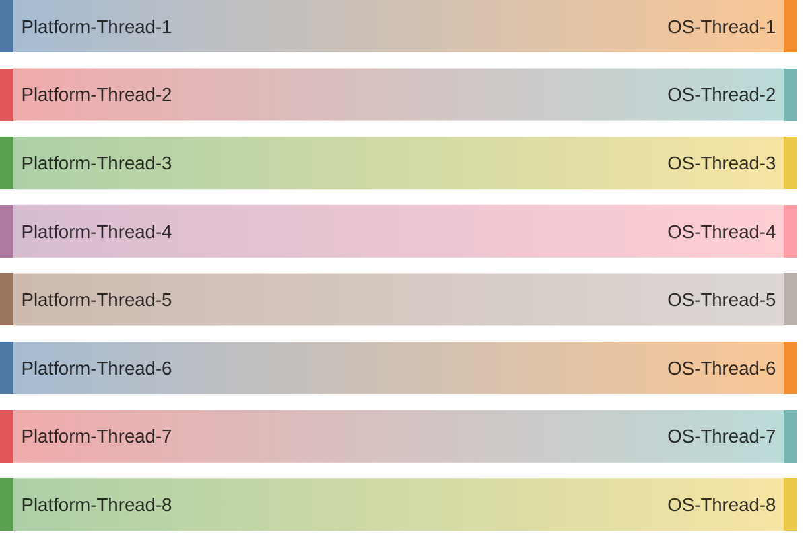
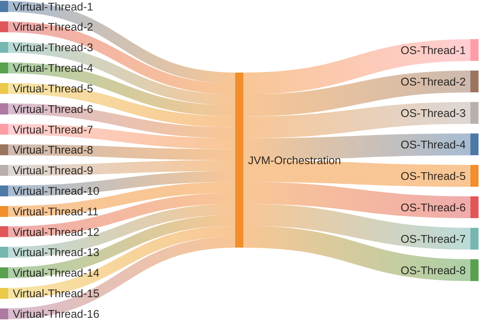

Do you know you can significantly improve the performance of your Spring Boot application in less than just two minutes? Yes, you heard it right! You can simply improve performance of your application by adding two configurations in your app. These configuration will enforce the use of **Virtual Threads** (in contrast to the default **Platform Threads**) on your Spring Boot application running on Tomcat Server. These changes will significantly improve the **throughput** of your Spring Boot application (and yes, I am not kidding!).

If you have already enabled Virtual Threads in your application, and you know what it does behind the scenes, feel free to skip this article. However, if you curious about changes that can increase the throughput of your application, learn about Virtual Threads, and understand what's going on under the hood of these changes, you are at the right place.

Okay, let's just cut to the chase and talk about the changes that can improve the throughput of your Spring Boot application. It's nothing but enabling the use of Virtual threads in Spring boot application.

# Using Virtual Threads in a Spring Boot application

If you are using Spring Boot version 3.2 or above and Java version 21+, you can simply add these two configuration in your app to enforce the use **Virtual Threads**

```java
@Bean(TaskExecutionAutoConfiguration.APPLICATION_TASK_EXECUTOR_BEAN_NAME)
public AsyncTaskExecutor asyncTaskExecutor() {
  return new TaskExecutorAdapter(Executors.newVirtualThreadPerTaskExecutor());
}

@Bean
public TomcatProtocolHandlerCustomizer<?> protocolHandlerVirtualThreadExecutorCustomizer() {
  return protocolHandler -> {
    protocolHandler.setExecutor(Executors.newVirtualThreadPerTaskExecutor());
  };
}
```

If you just wanted to improve throughput of your application and don't want to deep dive into the theory, you are all good till here and can skip the rest of the article.

If case you are still here, let's just buckle up and deep dive into some theory...

# What are Virtual Threads?

Before we deep dive into Virtual Threads it is important to understand what a platform thread is.

## Platform Threads

A Platform Thread is a thread that runs Java code on its underlying operating system (OS) thread. It is implemented as a thin wrapper around an OS thread and captures its OS thread for the platform thread's entire lifetime. Platform threads are suitable for running all types of tasks but are a limited resource due to the large runtime stack size. The diagram below shows 1-to-1 mapping of Platform threads with the OS Threads


## Virtual Threads

Virtual Threads, on the other hand, are user made threads scheduled by the Java Virtual Machine (JVM) rather than the underlying OS. Virtual threads introduce an abstraction layer between operating-system processes and application-level concurrency, allowing the JVM to mediate between the operating system and the program. This allows the JVM to manage more threads than the ones available on the underlying OS.

Virtual Threads are suitable for executing tasks that spend most of the time blocked, often waiting for the I/O operation to complete. Virtual Threads are not intended for long running CPU intensive operation.

The diagram below shows how virtual threads are mapped to OS threads via JVM orchestration.



## Benefit of using Virtual Threads

The main advantage of using Virtual Thread is that your application would now be able to **use greater number of threads** than they were able to use before. This is because the Java Virtual Machine (JVM) would assume responsibility of coordinating requests to the Operating System, managing them efficiently. As a result, numerous Virtual threads can bypass the waiting period associated with I/O operations and the Operating System, making them accessible to the next task.

# So why is our application faster now?

The configuration we added earlier, simply updated the executors of Tomcat to use **Virtual Threads** rather than the default Platform Threads. By default, Tomcat associates one HTTP request with one Platform thread which associates with one OS thread. However, with the Virtual Threads configuration, Tomcat can efficiently manage multiple concurrent requests as every request will associate with one virtual thread which will not hold/block the OS Threads during the execution, enabling more virtual threads to be processed with limited number of OS threads.

# References

1. [Embracing Virtual Threads](https://spring.io/blog/2022/10/11/embracing-virtual-threads)
2. [Platform Threads and Virtual Threads](https://docs.oracle.com/en/java/javase/21/core/virtual-threads.html)

